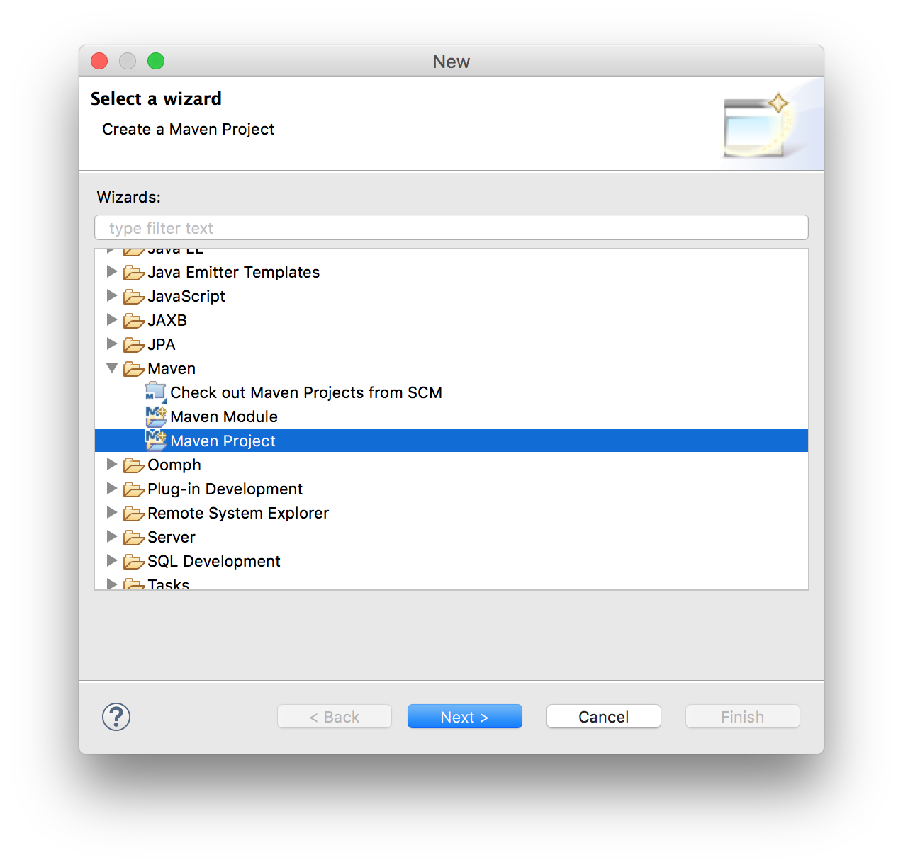
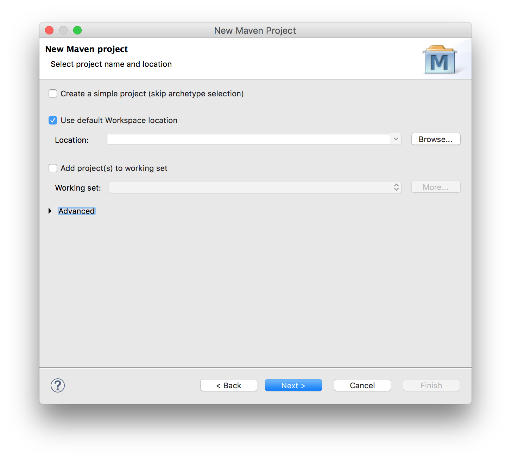
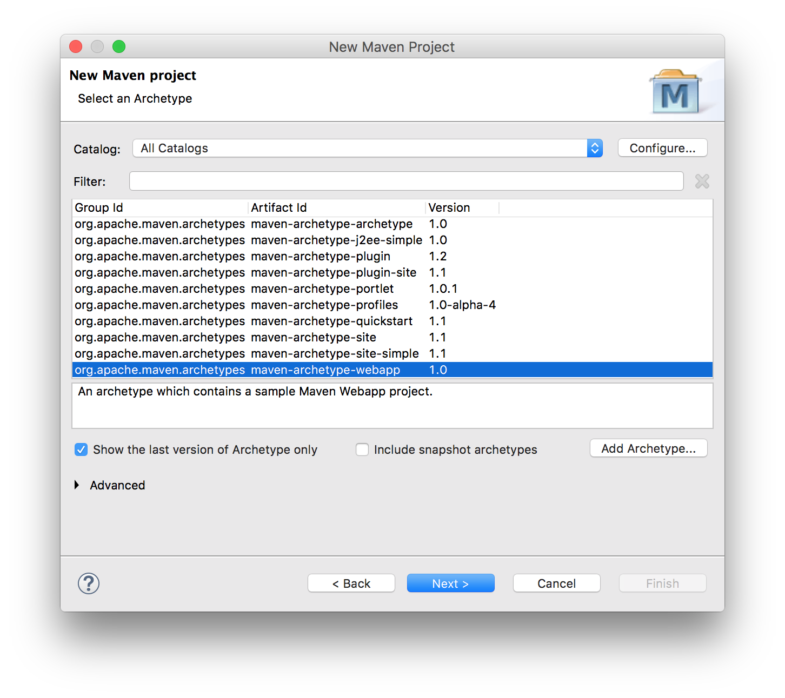
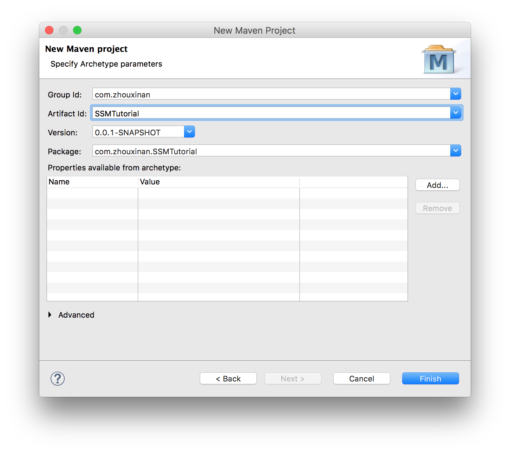

# SSMTutorial
Teach you how to implement websites with Spring-SpringMVC-MyBatis architecture.

## Raw materials
1. [Eclipse Java EE IDE (Neon.2 Release)](https://www.eclipse.org/downloads/) (Make sure you select Java EE IDE on the installation page)
2. Tomcat (8.5.11) (Using [brew](http://brew.sh) on macOS is encouraged: `brew install tomcat` )
3. [JDK Java SE 8u121](http://www.oracle.com/technetwork/java/javase/downloads/index.html)

## Step 1: Create a web project with Maven
Why do we use Maven? We, too often, find it tedious to manually add all kinds of dependencies to projects. We can thus tell Maven to automatically download these dependencies from [Maven Repository](http://mvnrepository.com) and add them to our projects, which is a quicker and safer approach.

1. Launch Eclipse, select File -> New -> Other -> Maven Project  

2. Select `webapp`  

3. Fill in Group Id and Artifact Id, such as `com.zhouxinan` and `SSMTutorial`  

