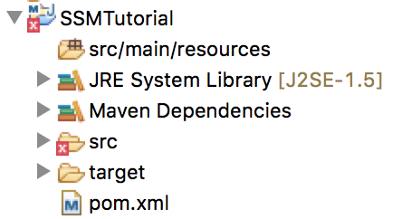
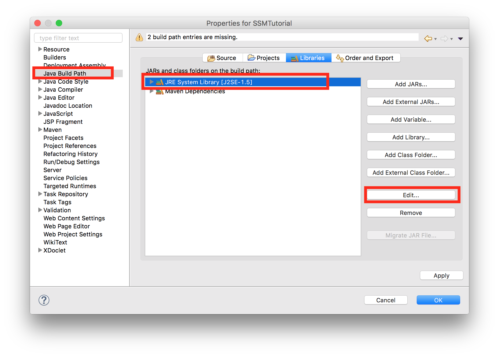
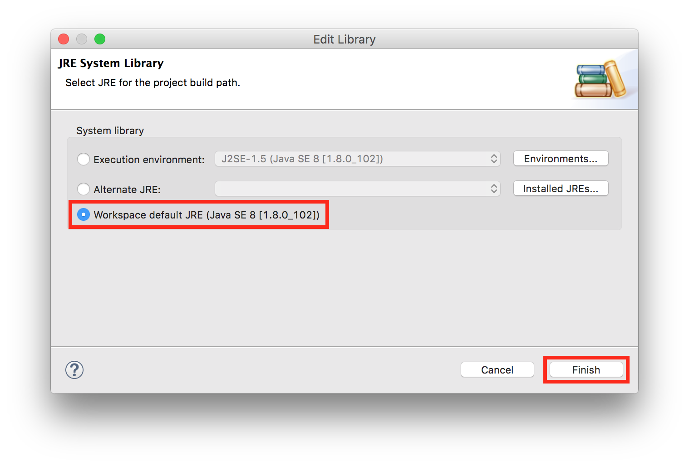
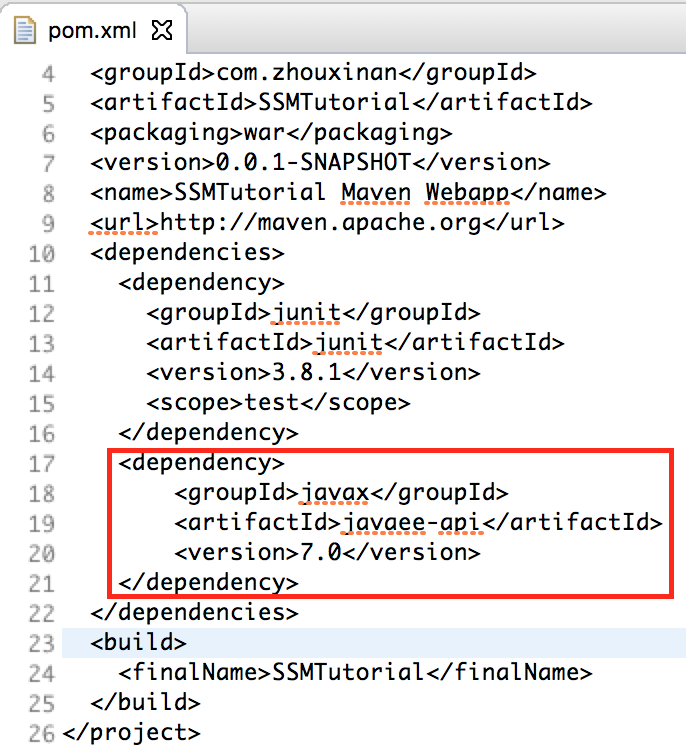

# SSMTutorial
Teach you how to implement websites with Spring-SpringMVC-MyBatis architecture.

## Raw materials
1. [Eclipse Java EE IDE (Neon.2 Release)](https://www.eclipse.org/downloads/) (Make sure you select Java EE IDE on the installation page)
2. Tomcat (8.5.11) (Using [brew](http://brew.sh) on macOS is encouraged: `brew install tomcat` )
3. [JDK Java SE 8u121](http://www.oracle.com/technetwork/java/javase/downloads/index.html)

## Step 1: Create a web project with Maven
Why do we use Maven? We, too often, find it tedious to manually add all kinds of dependencies to projects. We can thus tell Maven to automatically download these dependencies from [Maven Repository](http://mvnrepository.com) and add them to our projects, which is a quicker and safer approach.

1. Launch Eclipse, select File -> New -> Other -> Maven Project  


2. Select `webapp`  

3. Fill in Group Id and Artifact Id, such as `com.zhouxinan` and `SSMTutorial`, and click Finish.  


Now you can see that there are some errors with the newly created project. Let's fix them.  


1. Right-click `SSMTutorial` Project -> Properties -> Java Build Path -> JRE System Library -> Edit -> Workspace default JRE  



2. Open `pom.xml` under the project directory, and add the following code inside the `<dependencies>` tag, and save the file.
```
<dependency>  
    <groupId>javax</groupId>  
    <artifactId>javaee-api</artifactId>  
    <version>7.0</version>  
</dependency>
```


Now that all errors have been eliminated, let's go on to add more dependencies to our project.

## Step 2: Add more dependencies using Maven
To add a dependency to your project using Maven, you need to search it on [Maven Repository](http://mvnrepository.com), click the dependency you want, click the version you want, copy and paste `<dependency>` code to your `pom.xml`, just like what we have just done with [Java(TM) EE 7 Specification APIs](http://mvnrepository.com/artifact/javax/javaee-api).

I have prepared a list of dependencies you will need in this tutorial. Just copy and paste them to your `pom.xml`.

First, add a `properties` tag to your `pom.xml`, under the `<url>` tag. We store dependencies' version numbers there.
```
<properties>
    <org.springframework.version>4.3.6.RELEASE</org.springframework.version>
    <mybatis.version>3.4.2</mybatis.version>
    <mysqlconnector.version>5.1.40</mysqlconnector.version>
    <log4j.version>1.2.17</log4j.version>
    <slf4j.version>1.7.23</slf4j.version>
</properties>
```

Next, add the following dependencies:
```
<!--
    Core utilities used by other modules.
    Define this if you use Spring Utility APIs (org.springframework.core.*/org.springframework.util.*)
-->
        <dependency>
            <groupId>org.springframework</groupId>
            <artifactId>spring-core</artifactId>
            <version>${org.springframework.version}</version>
        </dependency>

        <!--
    Expression Language (depends on spring-core)
    Define this if you use Spring Expression APIs (org.springframework.expression.*)
-->
        <dependency>
            <groupId>org.springframework</groupId>
            <artifactId>spring-expression</artifactId>
            <version>${org.springframework.version}</version>
        </dependency>

        <!--
    Bean Factory and JavaBeans utilities (depends on spring-core)
    Define this if you use Spring Bean APIs (org.springframework.beans.*)
-->
        <dependency>
            <groupId>org.springframework</groupId>
            <artifactId>spring-beans</artifactId>
            <version>${org.springframework.version}</version>
        </dependency>

        <!--
    Aspect Oriented Programming (AOP) Framework (depends on spring-core, spring-beans)
    Define this if you use Spring AOP APIs (org.springframework.aop.*)
-->
        <dependency>
            <groupId>org.springframework</groupId>
            <artifactId>spring-aop</artifactId>
            <version>${org.springframework.version}</version>
        </dependency>

        <!--
    Application Context (depends on spring-core, spring-expression, spring-aop, spring-beans)
    This is the central artifact for Spring's Dependency Injection Container and is generally always defined
-->
        <dependency>
            <groupId>org.springframework</groupId>
            <artifactId>spring-context</artifactId>
            <version>${org.springframework.version}</version>
        </dependency>

        <!--
    Various Application Context utilities, including EhCache, JavaMail, Quartz, and Freemarker integration
    Define this if you need any of these integrations
-->
        <dependency>
            <groupId>org.springframework</groupId>
            <artifactId>spring-context-support</artifactId>
            <version>${org.springframework.version}</version>
        </dependency>

        <!--
    Transaction Management Abstraction (depends on spring-core, spring-beans, spring-aop, spring-context)
    Define this if you use Spring Transactions or DAO Exception Hierarchy
    (org.springframework.transaction.*/org.springframework.dao.*)
-->
        <dependency>
            <groupId>org.springframework</groupId>
            <artifactId>spring-tx</artifactId>
            <version>${org.springframework.version}</version>
        </dependency>

        <!--
    JDBC Data Access Library (depends on spring-core, spring-beans, spring-context, spring-tx)
    Define this if you use Spring's JdbcTemplate API (org.springframework.jdbc.*)
-->
        <dependency>
            <groupId>org.springframework</groupId>
            <artifactId>spring-jdbc</artifactId>
            <version>${org.springframework.version}</version>
        </dependency>

        <!--
    Object-to-Relation-Mapping (ORM) integration with Hibernate, JPA, and iBatis.
    (depends on spring-core, spring-beans, spring-context, spring-tx)
    Define this if you need ORM (org.springframework.orm.*)
-->
        <dependency>
            <groupId>org.springframework</groupId>
            <artifactId>spring-orm</artifactId>
            <version>${org.springframework.version}</version>
        </dependency>

        <!--
    Object-to-XML Mapping (OXM) abstraction and integration with JAXB, JiBX, Castor, XStream, and XML Beans.
    (depends on spring-core, spring-beans, spring-context)
    Define this if you need OXM (org.springframework.oxm.*)
-->
        <dependency>
            <groupId>org.springframework</groupId>
            <artifactId>spring-oxm</artifactId>
            <version>${org.springframework.version}</version>
        </dependency>

        <!--
    Web application development utilities applicable to both Servlet and Portlet Environments
    (depends on spring-core, spring-beans, spring-context)
    Define this if you use Spring MVC, or wish to use Struts, JSF, or another web framework with Spring (org.springframework.web.*)
-->
        <dependency>
            <groupId>org.springframework</groupId>
            <artifactId>spring-web</artifactId>
            <version>${org.springframework.version}</version>
        </dependency>

        <!--
    Spring MVC for Servlet Environments (depends on spring-core, spring-beans, spring-context, spring-web)
    Define this if you use Spring MVC with a Servlet Container such as Apache Tomcat (org.springframework.web.servlet.*)
-->
        <dependency>
            <groupId>org.springframework</groupId>
            <artifactId>spring-webmvc</artifactId>
            <version>${org.springframework.version}</version>
        </dependency>

        <!--
    Spring MVC for Portlet Environments (depends on spring-core, spring-beans, spring-context, spring-web)
    Define this if you use Spring MVC with a Portlet Container (org.springframework.web.portlet.*)
-->
        <dependency>
            <groupId>org.springframework</groupId>
            <artifactId>spring-webmvc-portlet</artifactId>
            <version>${org.springframework.version}</version>
        </dependency>

        <!--
    Support for testing Spring applications with tools such as JUnit and TestNG
    This artifact is generally always defined with a 'test' scope for the integration testing framework and unit testing stubs
-->
        <dependency>
            <groupId>org.springframework</groupId>
            <artifactId>spring-test</artifactId>
            <version>${org.springframework.version}</version>
            <scope>test</scope>
        </dependency>
        <dependency>
            <groupId>mysql</groupId>
            <artifactId>mysql-connector-java</artifactId>
            <version>${mysqlconnector.version}</version>
        </dependency>
        <dependency>
            <groupId>commons-dbcp</groupId>
            <artifactId>commons-dbcp</artifactId>
            <version>1.4</version>
        </dependency>
        <dependency>
            <groupId>jstl</groupId>
            <artifactId>jstl</artifactId>
            <version>1.2</version>
        </dependency>
        <dependency>
            <groupId>log4j</groupId>
            <artifactId>log4j</artifactId>
            <version>${log4j.version}</version>
        </dependency>
        <dependency>
            <groupId>com.alibaba</groupId>
            <artifactId>fastjson</artifactId>
            <version>1.2.9</version>
        </dependency>
        <dependency>
            <groupId>org.slf4j</groupId>
            <artifactId>slf4j-api</artifactId>
            <version>${slf4j.version}</version>
        </dependency>

        <dependency>
            <groupId>org.slf4j</groupId>
            <artifactId>slf4j-log4j12</artifactId>
            <version>${slf4j.version}</version>
        </dependency>
        <dependency>
            <groupId>org.mybatis</groupId>
            <artifactId>mybatis</artifactId>
            <version>${mybatis.version}</version>
        </dependency>
        <dependency>
            <groupId>org.mybatis</groupId>
            <artifactId>mybatis-spring</artifactId>
            <version>1.3.0</version>
        </dependency>
        <dependency>
            <groupId>com.fasterxml.jackson.core</groupId>
            <artifactId>jackson-core</artifactId>
            <version>2.7.3</version>
        </dependency>
        <dependency>
            <groupId>com.fasterxml.jackson.core</groupId>
            <artifactId>jackson-databind</artifactId>
            <version>2.7.3</version>
        </dependency>
        <dependency>
            <groupId>commons-io</groupId>
            <artifactId>commons-io</artifactId>
            <version>2.5</version>
        </dependency>
        <dependency>
            <groupId>commons-fileupload</groupId>
            <artifactId>commons-fileupload</artifactId>
            <version>1.3.1</version>
        </dependency>
```
